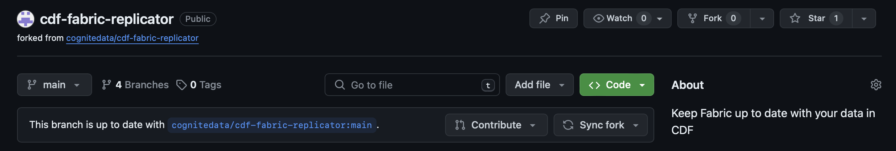

# Carbon Fabricator Repo Git Flow

This defines the expected git flow for branching and PRs between our [forked repo](https://github.com/kenny-chalupa/cdf-fabric-replicator) and [Cognite's open source repo](https://github.com/cognitedata/cdf-fabric-replicator).

## Sequence of Git Operations for code changes

1. Create a `topic branch` from the `forked repo: master`.

   - Ensure that master is synced, you should see this to validate:
     
     - the `forked repo: main` branch is a syncing branch, that is only intended to be the `forked repo` branch for having a reference to changes from the `open source repo: main branch`, so we are not to write to it except from the `open source repo: main branch`.

2. Make Changes to the `topic branch` and commit to the topic branch.

3. If these changes are to be proposed alone without aggregation of other changes to propose, continue to step 4, otherwise do the following:
   - Create a PR between `topic branch` and another new `general topic branch` which you want to hold all the relatable changes together
   - Collab with PR Reviewers and make changes as nessesary.
   - Once the changes are approved and agreed upon, merge this PR.
   - If you wish to continue to make changes to the `general topic branch` revert to **Step 2**.
   - If the `general topic branch` has all the changes you want to propose to the `open source repo`, continue to **Step 5**
     - NOTICE: you will need to keep the general topic branch synced with `forked repo: main` branch to ensure that the changes are up-to-date with the `open source repo: main` branch while accumulating changes.

4. Create a pr between the `topic branch` and the teams `forked repo: main` branch

   - This is an inner-team review of the code to collab on quality before we present changes to Cognite's `open source repo`
   - make changes as necessary from the PR.
   - once approved do not merge into main (currently you are unable to)

5. When you are ready to propose changes to the `open source repo` create a PR between your created `topic branch` | `general topic branch` and `open source repo: main`

6. Discuss changes with Cognite and continue committing if feedback is provided.

7. The project owner of the `open source repo` merges or closes the Pull Request.

8. Sync the updated `open source: main` back to `forked repo: main`.

## Diagram of Repo Changes Proposal

